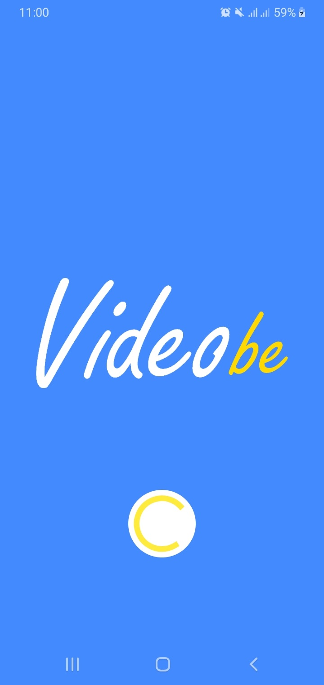

# ZaTribune-Videobe

  
  

## Overview  
These instructions will get you a copy of the project up and running on your local machine for development and testing purposes. See deployment for notes on how to deploy the project on a live system.

## Android Support
 minSdkVersion 16
 
## Built With  
&nbsp;&nbsp;&nbsp;&nbsp;**Java** - The Main Programming Language and Framework.  
&nbsp;&nbsp;&nbsp;&nbsp;**Andoid SDK** - Software Platform for creating and delivering Android Applications.   
&nbsp;&nbsp;&nbsp;&nbsp;**Android Studio** - Java IDE.  
&nbsp;&nbsp;&nbsp;&nbsp;**Gradle** - Dependency Management.  
&nbsp;&nbsp;&nbsp;&nbsp;**FFMpeg** - A software suite of libraries for handling video, audio, and other multimedia files and streams. 

## Authors  
   **Muhammad Ali Arafah** - find me on : [Twitter](https://twitter.com/ZaTribune), [LinkedIn](https://www.linkedin.com/in/zatribune).  

## Acknowledgments
Thanks to <a href="https://github.com/WritingMinds/ffmpeg-android-java">WritingMids</a> for providing FFMpeg-Android.
